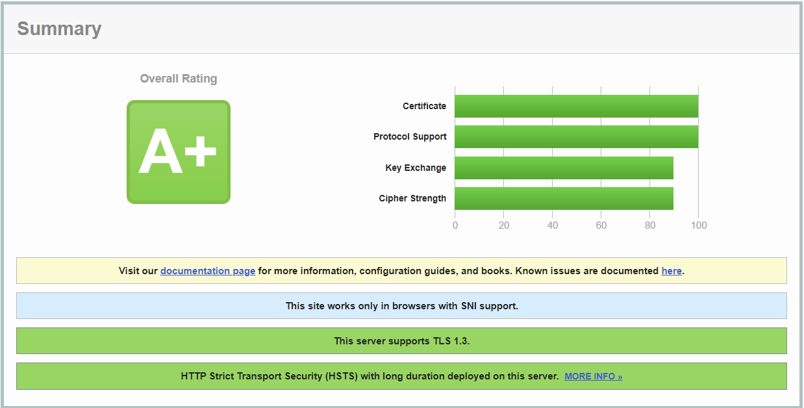

# Dockerized WordPress Stack with Traefik

This repository contains configuration files for deploying a Dockerized stack consisting of MySQL, WordPress, and Traefik. It automatically generates a Let's Encrypt certificate for the configured domain and renews it.
Follow the instructions below to set up and configure your environment.

## Prerequisites

- [Docker](https://www.docker.com/get-started)
- [Docker Compose](https://docs.docker.com/compose/install/)

## Configuration

### 1. Clone the Repository

```bash
git clone https://github.com/marcelwinh/wordpress-https-docker.git
cd wordpress-https-docker
```

### 2. Create the .env file
Create a copy of the .env.template file and name it .env.

```bash
cp .env.template .env
```
Edit the .env file and replace the values with your desired configuration.

### 3. Configure DNS Entries
To make your WordPress site accessible via a custom domain, configure DNS entries (A & AAAA records) for your domain.

A Record: Point the A record of your domain to the public IP address of your server.

```
A Record: @ -> Your_Server_IP
```
AAAA Record (Optional): If you have an IPv6 address, add an AAAA record.

```
AAAA Record: @ -> Your_Server_IPv6
```

### 4. Docker Compose Configuration
The docker-compose.yml file orchestrates the services. Ensure that the .env file values match the services' configurations.

```yml

version: '3.6'

services:
  mysql:
    # ... (MySQL configuration)

  wordpress:
    # ... (WordPress configuration)

  traefik:
    # ... (Traefik configuration)

networks:
  traefik:
    # ... (Traefik network configuration)
  wordpress:
    # ... (WordPress network configuration)
```

## Usage
### 1. Start the Stack:

Run the following command to start the stack in the background:

```bash
docker compose up -d
```

### 2. Access Your WordPress Site:

Open your web browser and navigate to the specified domain in the .env file (e.g., http://my-domain.tld). Your WordPress site should be accessible.

### 3. Traefik Dashboard:

Traefik's dashboard is available at http://<YOUR_IP>:8080. Monitor and manage your services from there.

## Customization
Adjust MySQL, WordPress, and Traefik configurations in the .env file to suit your preferences and environment.
Customize the WordPress site domain, version, and other settings in the .env file.

## Maintenance
### Stop the Stack:

```bash
docker compose down
```
### Backup
Creating a backup for your Dockerized WordPress stack involves preserving the configurations, data, and volumes associated with your services. Here's a guide on which folders to save:

#### 1. **Docker Compose Configuration:**
   - Save your `docker-compose.yml` file, which contains the configuration for your services.

   ```bash
   cp docker-compose.yml /path/to/backup
   ```

#### 2. **Environment Variables:**
   - Save your `.env` file, which contains environment variables for your services.

   ```bash
   cp .env /path/to/backup
   ```

#### 3. **WordPress Data:**
   - Save the directory specified in the `WORDPRESS_DATA_DIR` variable in your `.env` file. This directory contains WordPress site data, plugins, themes, and uploads.

   ```bash
   cp -r ./wordpress /path/to/backup
   ```

#### 4. **MySQL Data:**
   - Save the directory specified in the `MYSQL_DATA_DIR` variable in your `.env` file. This directory contains MySQL database data.

   ```bash
   cp -r ./mysql /path/to/backup
   ```

#### 5. **Traefik Configuration (Optional):**
   - Save the Traefik configuration and Let's Encrypt certificates if they are outside of the Docker volumes.

   ```bash
   cp -r ./letsencrypt /path/to/backup
   ```

#### Creating a Tar Archive:

To create a compressed backup archive of these folders, you can use the following command:

```bash
tar -czvf backup.tar.gz /path/to/backup
```

Replace `/path/to/backup` with the actual path where you want to store your backup.

#### Restoring from Backup:

To restore your stack from the backup, copy the backup archive to your server and extract it:

```bash
tar -xzvf backup.tar.gz -C /
```

Make sure to update your configurations and environment variables as needed before restarting your Docker stack.

Remember to perform backups regularly and store them in a secure location. Adjust the backup strategy based on your deployment's critical data and update frequency.


## SSL Labs Assessment Summary

### Overall Rating: A+



The [SSL Labs](https://www.ssllabs.com/ssltest/) assessment for this server resulted in an overall rating of A+, indicating a high level of security and adherence to best practices.

**Disclaimer: This assessment represents the current state and may change in the future. It's recommended to regularly check and update your server configurations to maintain optimal security.**

## Network Configuration

### traefik Network:

The `traefik` network is a Docker bridge network used for communication between Traefik and other services. It ensures seamless connectivity and routing.

### wordpress Network:

The `wordpress` network is another Docker bridge network facilitating communication between the WordPress service and other services. This network is used to isolate and manage communication between WordPress and other containers.

## Exposed Ports

### Traefik Service:

- **Port 80 (HTTP):**
  - Exposes the standard HTTP port for incoming web traffic.

- **Port 443 (HTTPS):**
  - Exposes the standard HTTPS port for secure web traffic.

- **Port 8080(DEBUG ONLY):**
  - Exposes the Traefik dashboard for monitoring and managing services.

### MySQL Service:

- No specific ports are exposed to the host machine. MySQL communication is internal.

### WordPress Service:

- No specific ports are exposed to the host machine. WordPress communication is internal.

These port configurations are designed to enhance security by limiting direct exposure to services. Traefik acts as a reverse proxy, managing external access to the internal services while providing additional features such as load balancing and SSL termination.


# Links to the docs:

- [MySQL](https://hub.docker.com/_/mysql)
- [WordPress](https://hub.docker.com/_/wordpress)
- [Traefik](https://hub.docker.com/_/traefik)
- [Let's Encrypt](https://letsencrypt.org/de/)


Happy Dockerizing!